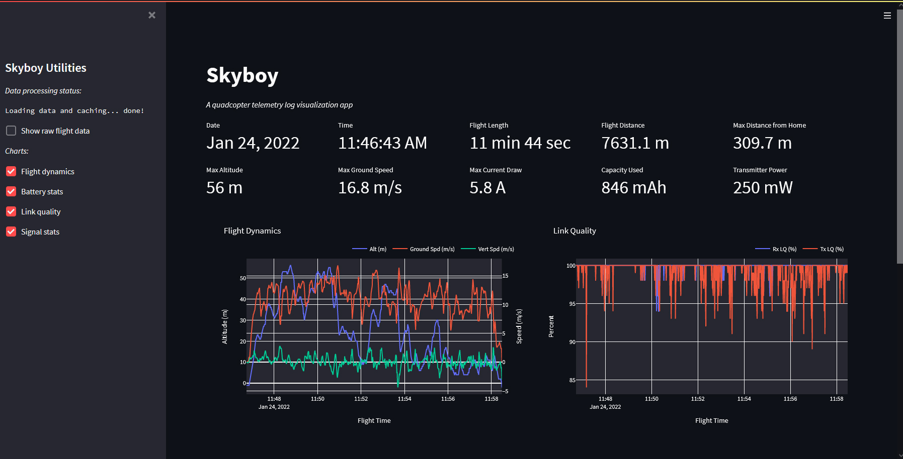

# Skyboy App

WIP

An application for visualizing FPV quadcopter telemetry data logged by OpenTx/EdgeTx.

_Development update Feb 10, 2022:_

* Refactored directory structure
* Added module for transforming data
* Added module for extracting/calculating metrics from dataset

_Development update Feb 9, 2022:_

* Added more charts
* Added flight metrics

_Development update Feb 8, 2022:_

* Added sidebar
* Added checkboxes to toggle content
* Added Flight Dynamics chart using plotly