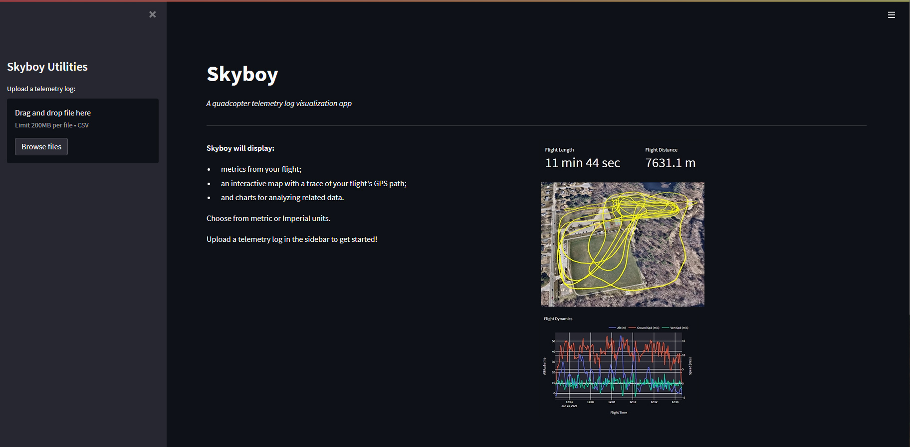

# Skyboy App

_An application for visualizing FPV quadcopter telemetry data logged by OpenTx/EdgeTx._

**Roadmap**

* :heavy_check_mark: [Deploy](https://skyboy.app) proof-of-concept with load-balancing and a domain
* :dart: Configure and implement Terraform for AWS infrastructure
* :dart: Add authentication and personal S3 buckets or directories
* :dart: Add S3 upload functionality
* :dart: Add S3 read/retrieve functionality
* :dart: more interesting/better 3D map?
* :dart: Sanity checks/error handling
* :dart: Modify transformations for logs from other receiver/radio combinations

_Development update Mar 18-23, 2022:_
* Terraform tested successfully in dev environment
* Created modular Terraform code for defining infrastructure

_Development update Mar 13-14, 2022:_
* Refactored Action to be reusable, which can be triggered from multiple branches
* Created and tested GitHub Action for automatically building and pushing images 

_Development update Mar 3, 2022:_
* Deployed Proof-Of-Concept with custom domain name (skyboy.app) on AWS

_Development updates February 2022:_
* Created Dockerfile and built application Docker image
* Added uploader utility (local memory storage only)
* Added content to initial application view (prior to uploading data)
* Added Mapbox map and basic flight path layer
* Added Python module for transforming data
* Added Python module for extracting/calculating metrics from dataset
* Added flight metrics
* Added checkboxes in sidebar to toggle content
* Added charts using plotly